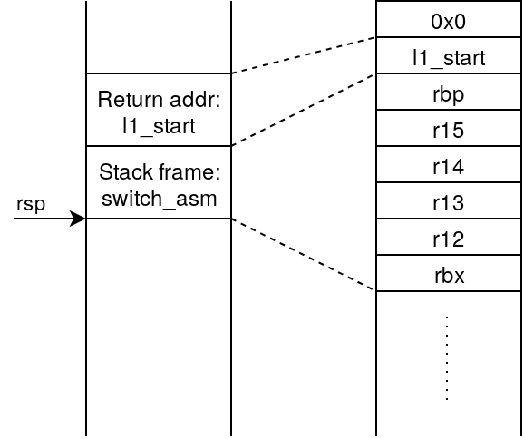
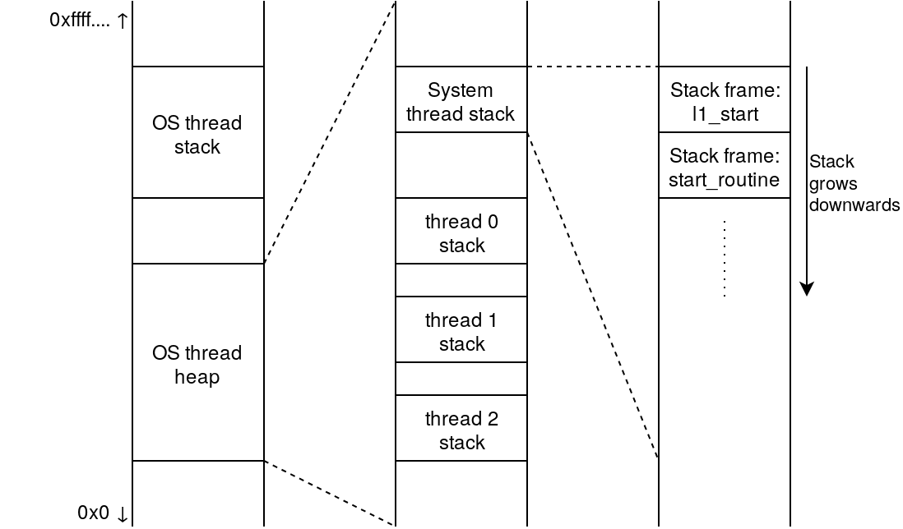

# Lab 1: Threading in Userspace

## Introduction

In this laboratory, we shall implement a userspace threading library that allows multiple 
execution contexts (or threads) to be time-multiplexed onto a single OS thread. Threads that 
are scheduled by such userspace libraries are generally called green threads. Green threads
require less state than OS threads, and are easier to switch between.

The goals of this lab are multifold:
- Be able to characterise the state of a green thread
- Implement the basic thread operations: create and join
- Implement different scheduling policies
- Implement different memory allocators 

The threads shall be co-operatively scheduled, i.e threads are responsible for yielding 
control to the scheduler when it cannot do useful work. This reduces the complexity of 
the scheduler because there is no asynchronous behavior or timers. On the other hand,
faulty/malicious threads can cause deadlocks or other threads to be starved of CPU time.

This lab shall span three weeks, and has a deadline of 23h00 on 03/11/2020. There are 
three phases:
- Threading: creation of thread (released 30/09)
- Scheduling: implementation of different scheduling policies (released 07/10), and
- Allocators: implementation of different memory allocators (released 14/10).

## Thread State

Let us first look at the API for green threads. There are two main functions:

- [`l1_error l1_thread_create(l1_tid *thread, void *(*start_routine)(void *), void *arg);`](../provided/thread.c)
- [`l1_error l1_thread_join(l1_tid thread, void **retval);`](../provided/thread.c)

The call to create a green thread explains the purpose of that thread: to execute the 
function `void *start_routine(void *)` with the provided argument. 
It also writes a unique identifier for the thread to first pointer so that the 
return pointer can be obtained by calling `l1_thread_join`.
This API is very similar to the `pthread` API but requires less state.

Every green thread operates on its own private stack that is allocated on the OS thread's heap.
The state of the green thread, therefore, is characterised by the following:
- Unique identifier
- Current status: Running, runnable, blocked or zombie. We explain these states later.
- Start routine: The function the thread executes
- Arguments: For the start routine
- If blocked, we also need to track which thread we are waiting for.

### Thread switching

The context of a thread can be summarized by its stack and the CPU registers. In
the provided framework, each thread has its own stack region allocated in
memory. In order to switch between threads, it thus suffices to save the needed
CPU registers and the thread's latest stack pointer, stored in the `sp`
register.

To perform the context switch, the provided framework calls [`switch_asm`](../provided/schedule.c),
which performs the following steps:

1. Pushes the CPU registers directly on the switching (source) thread's stack
2. Saves the source thread's `sp` to its internal thread info struct
3. Restores the target (destination) thread's `sp`
4. Pops the registers from the target thread's stack

Context switching is performed through a cooperative call to `yield(...)`. Each
thread can call `yield(-1)` to return control to the system thread, or
`yield(target)` to return control to the target thread directly (useful to start
a main thread). Thus, context switching is a function call, and it abides
by the ABI used by the compiler. `gcc` uses the [System-V](https://wiki.osdev.org/System_V_ABI), which specifies which registers must be
preserved across function calls (callee-saved). Hence, when calling `yield`, a
thread expects only that set of registers to be preserved, which is a small
subset of all the available CPU registers, reducing the context switching
overhead.

At thread creation, the stack is initially empty (freshly allocated). However,
the provided framework expects that the thread's context (register values) is
saved on its stack. Therefore, it is the responsibility of the thread creation
function to set up the stack such that the needed register values are pushed on
it in a specific order. This order is portrayed by the following figure:

For the purposes of stack alignment, the initial value of the stack pointer 
needs to be eight bytes below the alignment boundary (16B). An easy way to 
achieve this is to push any 8B word to the stack before pushing `l1_start`. 
This preserves compatibility with the System-V ABI, which requires that 
"the stack is 16-byte aligned just before the call instruction is called."

Initial register values can be set to any value (preferably zero). When
`switch_asm` switches to a new thread's context, it restores the saved registers
on the stack, and jumps to the first address on the stack (the return address).
When `l1_start` is executed, it bootstraps the thread to call its assigned
routine, stored in the thread's info struct, inside the `thread_func` data
member, which takes `thread_func_args` as an argument. As such, in the steady
(running) state, a thread's stack looks as portrayed in the following figure:

## Scheduling

Unlike your desktop's operating system, the threads in this lab are co-operatively scheduled.
This means that threads are not pre-empted, instead running until they yield to the scheduler.
As an argument to the `yield()` call, one can pass the ID of the thread to which they wish to 
yield to. 

There are various operations that can result in a thread yielding CPU such as thread joining, 
waiting on communication primitives such as mutexes, semaphores or messaging. In this lab,
we only implement waiting on other threads. In later labs, we will see some of the other
forms. 

There are 4 states that a thread may be in:
- Running: This means that the thread is currently executing
- Runnable: This means that the thread has not finished, is not blocked and may be executed.
- Blocked: This means that the thread is waiting on some event. For example, join causes a thread
           to be blocked waiting for another thread to complete.
- Zombie: This is a thread that has finished its execution, but has not been deleted yet. 

Scheduling is the task of choosing which thread gets to run when we yield the CPU. As discussed
in the lectures, there may be various policies to choose the next task when there are multiple
runnable threads. In this lab, we provide two mechanisms for changing tasks. `yield` takes a
parameter `next` which specifies what the next thread to run is, optionally yielding to the 
system thread when the argument is -1. In this case, the scheduler is responsible for choosing
the next task, and it uses the policy as specified in `sched_policy select_next;` field in the
scheduler structure. An example policy (round robin) is implemented in [`sched_policy.c`](../provided/schedule.c) and
will be used for week 3. In later weeks, we will introduce and implement other policies. 

## Tasks for week 3

In this week, we require you to implement thread creation and thread joining, specifically 
[`l1_thread_create`](../provided/thread.c) and [`l1_thread_join`](../provided/thread.c).

### l1\_thread\_create 

For creating a new thread, you have to primarily do two jobs: firstly, you must set up the 
`l1_thread_info` structure to accurately reflect the new thread's starting state.
Secondly, you must setup the stack where the new thread can execute. However, the thread
state must also allow the thread to cleanly exit when the `start_routine` finishes.

For this purpose, we provide you with the function `l1_start(void)` which acts as a 
caller for `start_routine`. Essentially, we setup the stack to reflect the state within
`switch_asm` where the original thread's stack pointer is replaced by the destination
thread's stack pointer. Therefore, when the scheduler selects the new thread and tries
to switch to it, it will see a state equivalent to a thread which has called
`switch_asm`. 

Essentially, the entry point to `l1_start` acts as the return
address for `start_routine`.

_Hint: Return address for the call stack are stored on the stack in stack frames. 
For more information about stack frames on x86-64, refer to 
<https://eli.thegreenplace.net/2011/09/06/stack-frame-layout-on-x86-64/>_ 

### l1\_thread\_join

For joining on a target thread, you will need to set-up the `l1_thread_info`
before yielding to the scheduler. 

This function is expected to fail with the error code `ERRINVAL` if the 
target thread does not exist.

As with `pthread_join`, the behavior when multiple threads join on the same
target are undefined. Therefore, you are not required to check if other threads
are waiting on the same target.

### More information about join

Join is used to tell the scheduler that the current thread does not want to run until the target is done running.
The current thread, i.e., the one that called join, must setup information in its own *l1_thread_info* structure to let the scheduler know how it should be handled.

The important fields are: 

1. *state*: the current thread's info should use this field to tell the scheduler that it wants to block.
2. *joined_target*: the current thread's info should contain the target's tid value.
3. *join_recv*: the current thread's info should contain the retval pointer, i.e., the variable in which the current thread will receive the target's return value.
4. *errno*: this field is used by the scheduler to communicate with the thread. It should be initialized to SUCCESS before yielding to the system. After returning from the system thread, i.e., when the current thread gets re-scheduled, errno will hold either SUCCESS, or an error value if the system thread was unable to make the current thread join on its target (e.g., the target does not exist, or got joined by someone else first).

In join, you should:

1. Make sure the current thread's *l1_thread_info* structure contains correct values for these fields.
2. Yield to the scheduler.
3. Check the *errno* value from the current thread's *l1_thread_info* structure. This is what join should be returning.
4. Clean up the current's thread *joined_target*, *errno*, and *join_recv*.
5. return the value (SUCCESS or an error) you read at point 3.

## Tasks for week 4

This week, you will add new scheduling policies to the [`sched_policy.*`](../provided/sched_policy.c) [files](../provided/sched_policy.h), replacing the simple round robin scheduler from last week.
You will be in charge of implementing two policies named `l1_smallest_cycles_policy` and `l1_mlfq_policy`. The first policy simply picks the thread that has been running for the fewest cycles. The second policy is the one you learned about in class, called Multi-Level Feedback Queues (MLFQ).

### Extensions to `l1_thread_info`

For this lab, `l1_thread_info` was extended with new attributes that you will need to correctly initialize in `l1_thread_create`:

1. *priority_level:* the thread's priority level used by mlfq. All threads start at `TOP_PRIORITY`, defined in `priority.h`.
2. *got_scheduled:* indicates if the thread has been selected by the scheduler since its priority got set to this current value.
3. *total_time:* accumulator for the total time this thread has been executing.
4. *slice_start:* absolute time measurement taken when the thread gets selected by the scheduler to execute next.
5. *slice_end:* absolute time measurement taken when the thread gets descheduled by the scheduler.

All time values are of type `l1_time`, defined in `l1_time.*`. These files provide functions to initialize, add, subtract, compare, and get time measurements. This allows to replace the implementation of `l1_time` with simpler or more complex types.

### Scheduling policy API

We have provided you an enhanced `schedule()` function since the last lab. You do not have to edit `schedule()` to implement the various scheduling policies. 
All scheduling policies have the same interface, i.e., `l1_thread_info* (*sched_policy)(l1_thread_info* prev, l1_thread_info* next)`. A few rules must be observed when implementating a policy in order to stay compatible with the `schedule()` function: 

1. A policy should *not* remove `prev`, `next`, or the selected target from its list. The scheduler moves `prev` to the end of the runnable queue (if it is runnable) before calling the scheduling policy function. The scheduler also moves a thread to the head of the queue right before scheduling it.
2. A policy can decide to ignore `next` and select its own thread to schedule next. In other words, the scheduling policy can *bypass* the yield semantics.
3. The selected thread to run next must be `RUNNABLE` and be inside the list of runnables.
4. The `prev` value is the thread that just executed and is never NULL. The scheduler is allowed to inspect and change its priority and time metrics, but not its list or state.
5. The `schedule()` function updates `total_time`, `slice_start`, and `slice_end` *before* calling your scheduling policy. In other words, you do not need to modify these values, unless you want to reset them.

### Smallest cycles policy

The first scheduling policy that you need to implement is `l1_smallest_cycles_policy`.
It works in the following way: 

1. If the suggested `next` value is not null, the policy should return that thread.
2. Otherwise, find the runnable thread with the smallest `total_time` value and schedule it.

The `total_time` value is set for you by the `schedule()` function.

### MLFQ

The second scheduling policy you need to implement is `l1_mlfq_policy` and is more complicated. 
As explained in the course's *scheduling* slides, multi-level feedback queues (MLFQ) define 6 rules:

1. `if priority(A) > priority(B) then return A`
2. `if priority(A) == priority(B) then A, B run in round robin`
3. All threads start at top priority.
4. If a thread uses up its whole time slice, demote it to lower priority (time slices are longer at lower priority).
5. If a thread has not been run for some time, boost its priority.
6. If a thread's total time **at its current priority level** (not just the last time slice) has exceeded a threshold time, demote it to a lower priority.

**IMPORTANT** When implementing these 6 rules, pay attention to whether or not multiple rules apply to the same thread, and what order to apply them in. You should consider this when updating any data structures, as the demotions/promotions from one rule, may trigger another.

To help you implement `l1_mlfq_policy`, we provide several helper functions and attributes:

1. `l1_priority_slice_size` defined in [`priority.*`](../provided/priority.c) returns, for a given priority level, the corresponding maximum slice size.
2. `TIME_PRIORITY_THRESHOLD` defined in `priority.*` is the threshold described in rule 6. 
3. `l1_priority_decrease` allows you to decrease the priority level of a thread.
4. `l1_priority_increase` allows you to increase the priority level of a thread.
5. The `l1_thread_info` attribute `got_scheduled` is set to 1 just before switching execution to this thread.
6. The `l1_scheduler_info` structure has an attribute called `sched_ticks`, incremented everytime the `schedule` method runs. This value goes from 0 to `SCHED_PERIOD -1` and defines a periodic time for use with Rule 5.

The MLFQ policy ignores the `next` target in favour of the 6 above rules.
MLFQ is, however, responsible for updating the priority level of the `prev` thread.
If MLFQ decides to change *any* thread's priority level (increase *or* decrease), it is responsible for resetting the `l1_thread_info` attributes described above (e.g., `got_scheduled`, `total_time`, etc.).
MLFQ should *not* change a thread's state (e.g., changing it to BLOCKED) or touch the scheduler queues themselves.

